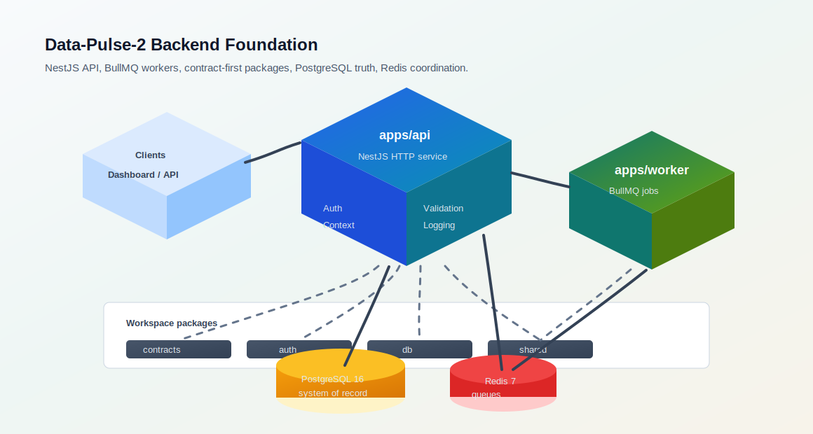
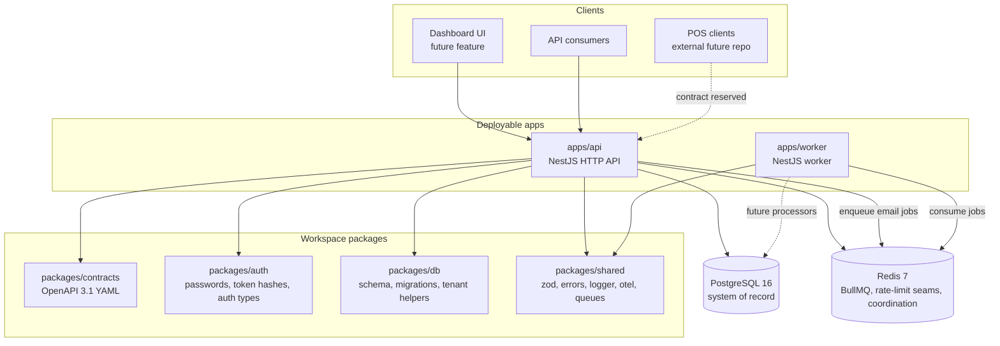
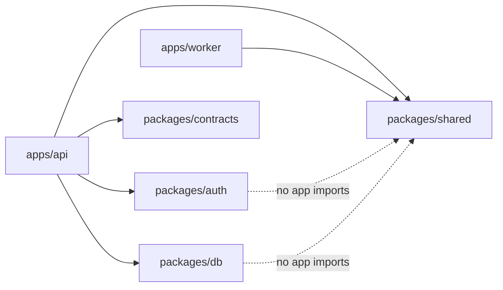
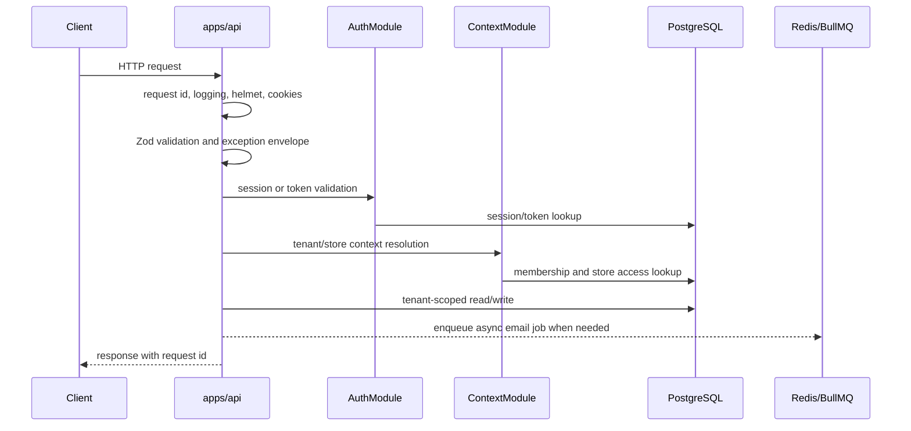
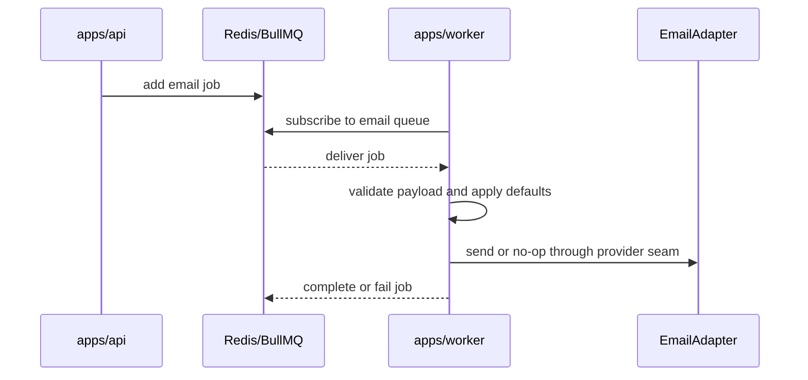
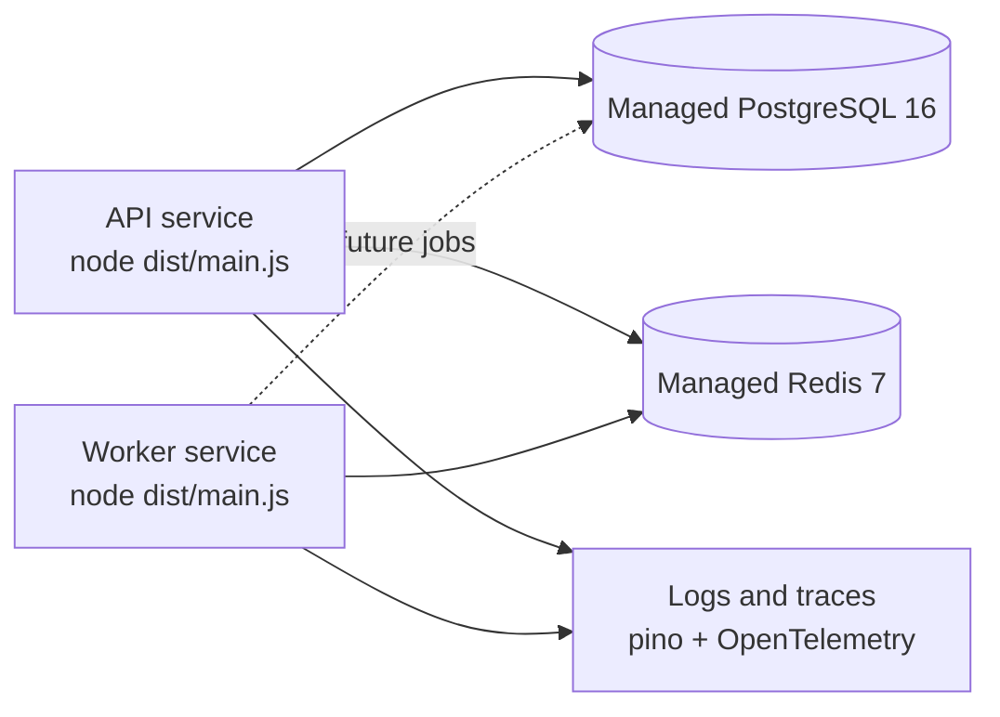

# Data-Pulse-2 Architecture

Data-Pulse-2 is a backend-first TypeScript monorepo for a multi-tenant SaaS
foundation. The current repository owns the API, worker runtime, contracts,
database schema, and shared platform primitives. The dashboard frontend is a
separate future feature, and POS applications are external to this repository.

## System Shape

## Runtime Responsibilities

| Runtime | Owns | Does not own |
| --- | --- | --- |
| `apps/api` | HTTP bootstrap, auth endpoints, active tenant/store context, validation, exception envelopes, request IDs, logging, OpenAPI contract loading, PostgreSQL access, queue production. | Background processing, dashboard UI, POS app code. |
| `apps/worker` | Standalone Nest application context, BullMQ worker factory, email queue consumption, provider-adapter seams, graceful shutdown. | HTTP routing, tenant context selection, frontend behavior. |
| PostgreSQL | Durable source of truth, constraints, migrations, tenant isolation policy support. | Cache semantics or queue delivery. |
| Redis | BullMQ transport and runtime coordination seams. | Durable domain truth. |

## Package Boundaries

Rules:

- Apps may depend on packages.
- Packages must not import from `apps/*`.
- `apps/api` and `apps/worker` do not import from each other.
- OpenAPI YAML in `packages/contracts/openapi` is the contract source of truth.
- SQL migrations under `packages/db/drizzle` are versioned review artifacts.

## API Request Flow

## Worker Flow

## Data Model Themes

- Tenant, store, membership, role, permission, session, token, invitation,
  audit, and idempotency tables live in `packages/db/src/schema`.
- `packages/db/drizzle/0000_initial.sql` is the initial migration artifact.
- Tenant-scoped access should move through helpers such as `withTenant` and
  request DB context middleware rather than ad hoc SQL filtering.
- Cross-tenant and cross-store tests are required for behavior that touches
  tenant-owned data.

## Deployment View

Required production configuration:

- `DATABASE_URL` for API database access.
- `REDIS_URL` for production API email job enqueueing and worker queue
  consumption.
- `LOG_LEVEL` when the default `info` level is not appropriate.

## Current Gaps By Design

- Dashboard/web UI is not scaffolded in this foundation slice.
- POS endpoints are reserved by contract strategy but are out of scope here.
- Real email provider wiring is behind the worker adapter seam.
- Additional domain modules such as tenants, stores, memberships, invitations,
  and audit are staged through the active specification and task list.
