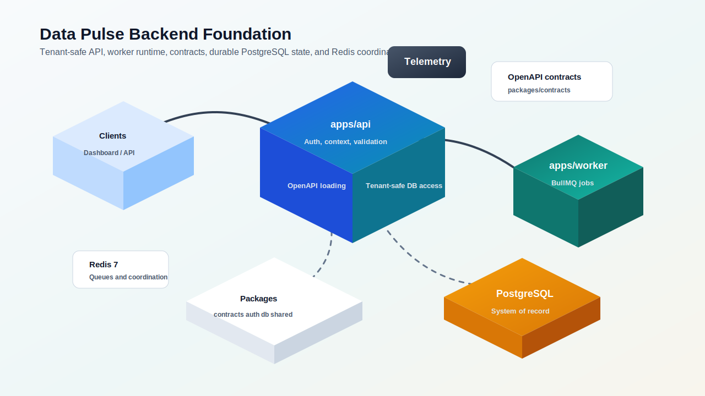
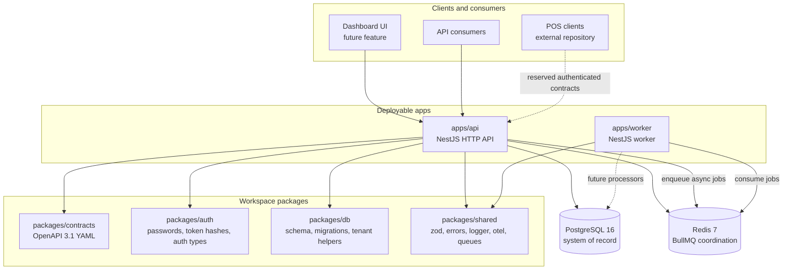
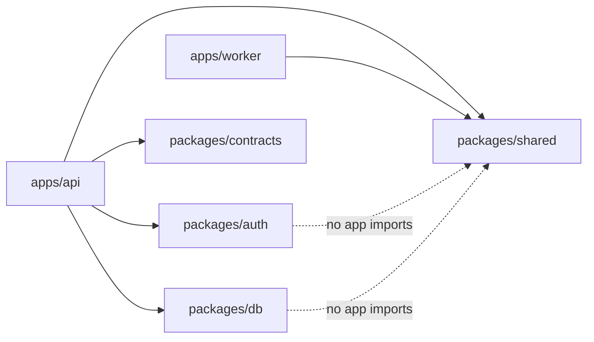
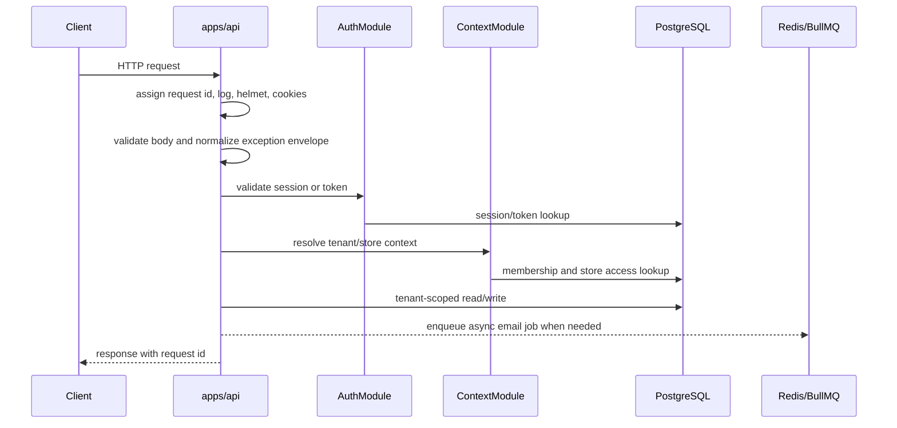
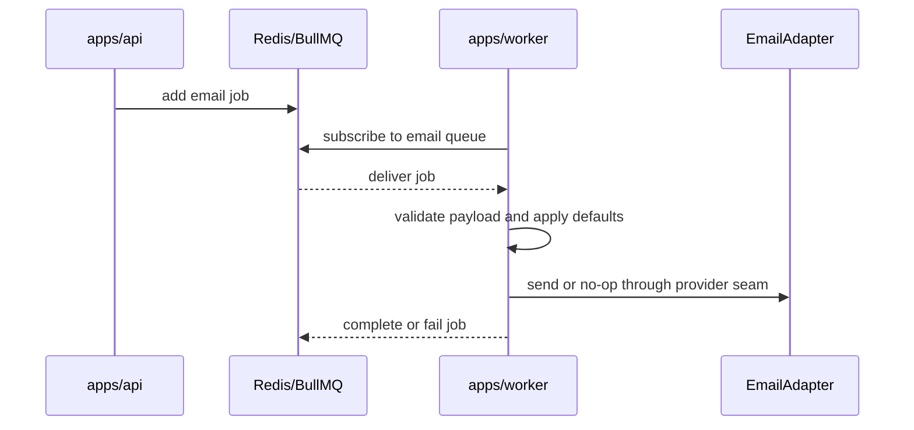
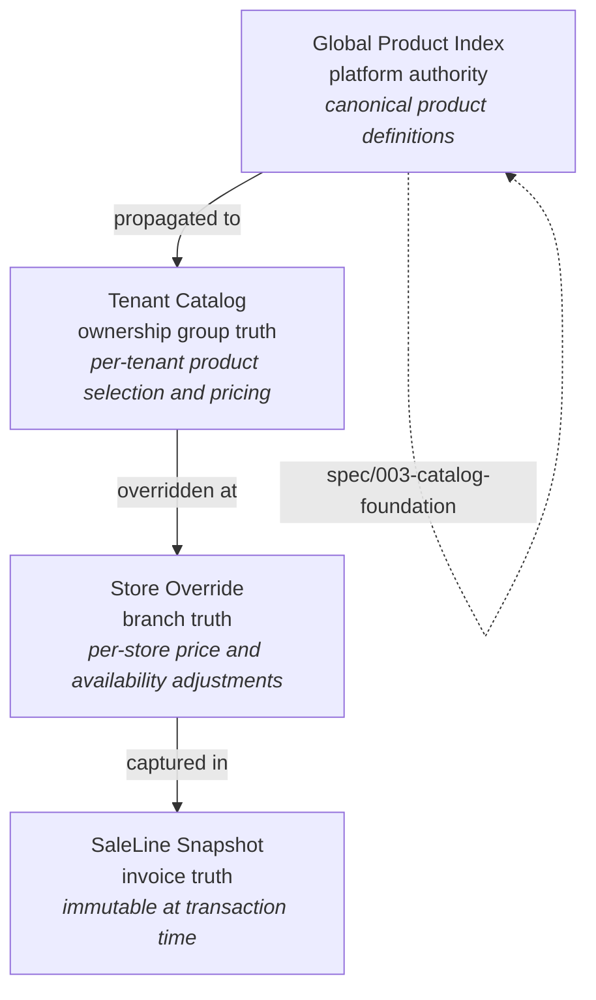
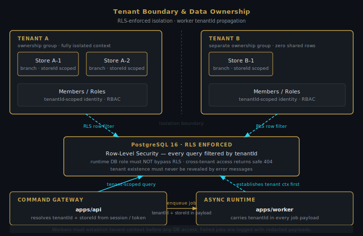
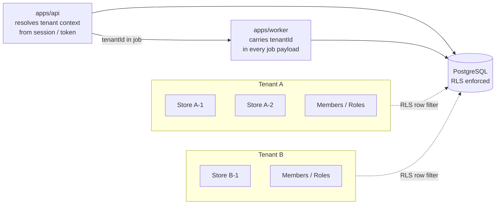
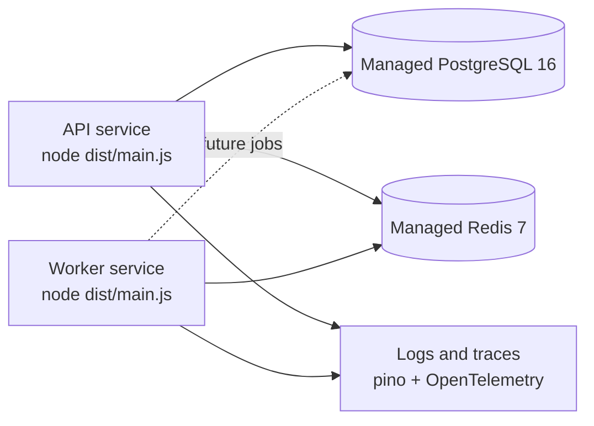

# Data Pulse Architecture

Data Pulse (`Data-Pulse-2`) is the backend-first implementation of **Retail Tower OS** — the
command layer for multi-branch retail operations. This repository owns the API, worker runtime,
contracts, database schema, and shared platform primitives. Dashboard UI work is deferred to a
separate feature, and POS applications remain external repositories.

## Executive Summary

Data Pulse separates synchronous platform behavior from asynchronous processing.
`apps/api` handles authenticated HTTP requests, tenant/store context selection,
validation, logging, contract loading, and database access. `apps/worker`
handles background jobs through Redis and BullMQ. Internal packages hold the
shared contracts, database schema, auth primitives, and cross-cutting platform
utilities.

PostgreSQL is the durable source of truth. Redis is runtime coordination, never
domain truth. OpenAPI YAML in `packages/contracts/openapi` is the integration
contract of record.

## System Shape

> **Visual map** — presentation-grade platform topology.

> **Reviewable Mermaid source** — technical diagram kept for diffability and
> tooling compatibility.

## Runtime Responsibilities

| Runtime | Owns | Does not own |
| --- | --- | --- |
| `apps/api` | HTTP bootstrap, auth endpoints, active tenant/store context, validation, exception envelopes, request IDs, logging, OpenAPI contract loading, PostgreSQL access, queue production. | Background processing, dashboard UI, POS app code. |
| `apps/worker` | Standalone Nest application context, BullMQ worker factory, email queue consumption, provider-adapter seams, graceful shutdown. | HTTP routing, tenant context selection, frontend behavior. |
| PostgreSQL | Durable source of truth, constraints, migrations, tenant isolation policy support. | Cache semantics or queue delivery. |
| Redis | BullMQ transport and runtime coordination. | Durable domain truth. |

## Package Boundaries

Boundary rules:

- Apps may depend on packages.
- Packages must not import from `apps/*`.
- `apps/api` and `apps/worker` do not import from each other.
- OpenAPI YAML in `packages/contracts/openapi` is the contract source of truth.
- SQL migrations under `packages/db/drizzle` are versioned review artifacts.

## API Request Flow

> **Visual map** — request pipeline through the guard chain to service layer
> and response.

> **Reviewable Mermaid source** — technical sequence diagram.

## Worker Flow

## Data Model Themes

- Tenant, store, membership, role, permission, session, token, invitation,
  audit, and idempotency tables live in `packages/db/src/schema`.
- `packages/db/drizzle/0000_initial.sql` is the initial migration artifact.
- Tenant-scoped access should move through helpers such as `withTenant` and
  request DB context middleware rather than ad hoc SQL filtering.
- Cross-tenant and cross-store tests are required for behavior that touches
  tenant-owned data.

## Catalog Source-of-Truth Layers

The catalog model follows a four-layer authority hierarchy. Each layer is owned
by a distinct actor and may override the layer above it for its scope.

Layer ownership rules:

| Layer | Owner | Can override | Immutable after |
| --- | --- | --- | --- |
| Global Product Index | Platform admin | — | Product deactivation |
| Tenant Catalog | Tenant admin | GPI defaults | — |
| Store Override | Store manager | Tenant price/availability | — |
| SaleLine Snapshot | System (at sale time) | — | Commit |

Historical sale facts must not be silently rewritten by catalog changes.
A SaleLine Snapshot carries the price and product description as they were
at transaction time, not as they are today.

## Tenant Boundary and Data Ownership

> **Visual map** — tenant isolation zones, RLS boundary, and tenantId
> propagation through API and worker.

> **Reviewable Mermaid source** — technical diagram.

Every piece of domain data is owned by exactly one tenant. Tenant context is
established at the API boundary and propagated through every subsequent
database access, worker job, and audit record.

Isolation rules:

- Runtime DB role must not bypass RLS.
- Cross-tenant access returns a safe 404 — never a permission error that leaks
  tenant existence.
- Workers establish tenant context before any DB access.
- Audit records carry `tenantId`, `storeId`, `actorId`, and `correlationId`.

## Deployment View

Required production configuration:

- `DATABASE_URL` for API database access.
- `REDIS_URL` for production API email job enqueueing and worker queue
  consumption.
- `LOG_LEVEL` when the default `info` level is not appropriate.

## Current Gaps By Design

- Dashboard/web UI is not scaffolded in this foundation slice.
- POS endpoints are reserved by contract strategy but POS app code is out of
  scope here.
- Real email provider wiring is behind the worker adapter seam.
- Additional retail domain modules are staged through active specifications and
  task lists.
