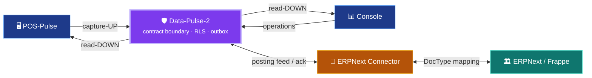
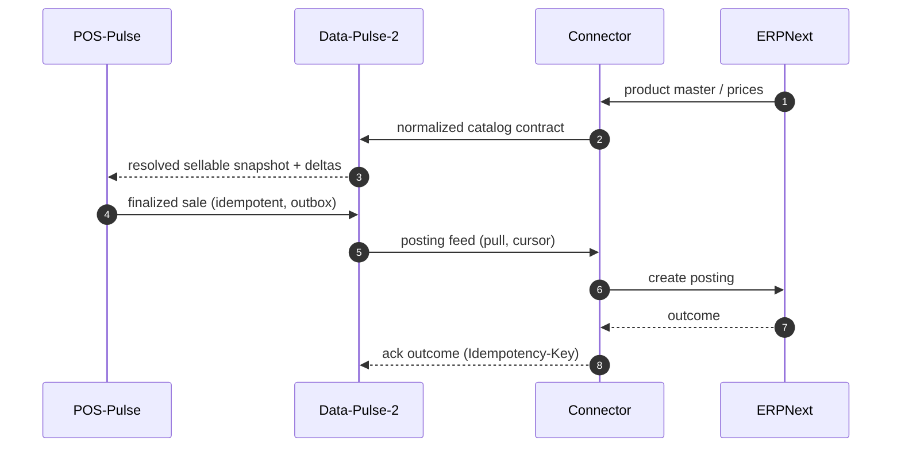

# Synchronization — Data-Pulse-2 at the Core

> Data-Pulse-2 is the **single contract boundary** of Retail Tower OS. Every edge syncs through
> it; only the connector ever reaches ERPNext.

<p align="center">
  
</p>

```text
POS-Pulse ─┐
           ├─▶  Data-Pulse-2  ─▶  ERPNext Connector  ─▶  ERPNext / Frappe
Console  ──┘        ▲ the only contract boundary
```

## Two directions

| Direction | What moves | Path |
|---|---|---|
| 🔵 **Read-DOWN** | Resolved sellable catalog, product master, prices | DP2 → POS / Console |
| 🟠 **Capture-UP** | Sales & inventory, posting feed + outcome ack | POS / Console → DP2 → Connector → ERPNext |



## A sale's round trip



## What the boundary guarantees

| Concern | Guarantee |
|---|---|
| Tenant / store isolation | Postgres RLS — no cross-tenant leakage at the data layer |
| Contract of record | `packages/contracts/openapi/**` — edges depend on contracts, never on each other |
| ERPNext coupling | Isolated to the connector — edges stay ERPNext-agnostic |
| Money | Integer minor units / value objects — never floats |

Program-wide view: the
[Retail-Tower-Orchestrator](https://github.com/ahmed-shaaban-94/Retail-Tower-Orchestrator)
control plane.

> Architecture is stable; this document does not assert feature/merge status. See `specs/**`,
> `docs/agent-os/`, and `CLAUDE.md` for the authoritative implementation state.
