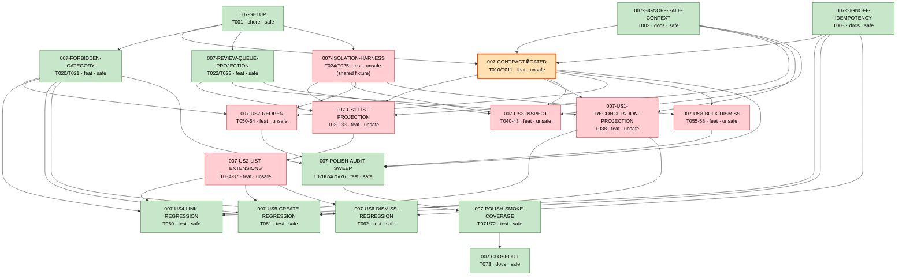

# Wave Status — `007-unknown-items-review-queue-api`

> ## ✅ WAVE CLOSED — 2026-05-30 (007-CLOSEOUT / T073, PR #417)
> The 007 Unknown Items Review Queue API spec is **COMPLETE**. Every
> Claude-executable slice has shipped to `main`. Final tally: **16 merged /
> 3 proposed-by-design** (SETUP + the two `[SIGN-OFF]` decision gates, whose
> verdicts are recorded below). **0 open findings.** No further 007 work is
> planned — see § Wave-close summary.

**Last updated:** 2026-05-30 (WAVE CLOSED via #417 — 007-CLOSEOUT/T073)
**Spec:** [`specs/007-unknown-items-review-queue-api/`](./)
**Base:** `origin/main` at `4edda4d` (PR #416, POLISH-SMOKE-COVERAGE closeout, 2026-05-30) → closed by #417
**Branch:** ALL slices terminal on `main`; spec complete (planning on `spec/007-unknown-items-review-queue-api`)
**Active findings:** 0
**Resolved findings:** 1 (reopen fresh-capture metric — deliberate POS-scoped exclusion)

---

## TL;DR

**007 is the dashboard-facing API feature that 006 deferred** (006 plan §9.1), now implementable since 005 Waves 1+2 shipped (contract + runtime on `main`). It **extends** the already-shipped 005 unknown-items surface rather than greenfielding: the genuine delta is **inspect (GET /{id})**, **reopen**, **bulk-dismiss**, **list-param extensions**, the **`forbidden`** 8th error category, and the **`ReviewQueueItem`** projection (omits `sale_context`).

**Planning chain on `main`** (content squash-merged via docs PRs #400 / #402; original branch SHAs):

- `aab701d` — spec + clarify + plan + Phase 0/1 artefacts
- `45ae621` — tasks.md (Phase 2 — 39 dependency-ordered slice tasks)
- `8a97e97` — analyze remediation (3 polish tasks T074–T076 + FR traceability refs → 42 tasks)

`/speckit-analyze` (2026-05-29) found **0 CRITICAL**, spec/plan/tasks consistent. Both `[SIGN-OFF]` decision gates are recorded below, and the `[GATED]` T010 contract slice plus the Wave 1 P1-MVP runtime have since shipped.

**Status (2026-05-29):**

1. ✅ Both SIGN-OFF decisions recorded (this document, § SIGN-OFF Decisions).
2. ✅ `[GATED]` T010 OpenAPI extension merged — PR #404 (`f2622ee`).
3. ✅ Wave 1 Phase 2–5 P1-MVP runtime merged — PR #405 (`0c1bec7`) + CodeRabbit follow-up PR #406 (`62d0906`).

**Next:** Phase 6 (US7-REOPEN) onward — see § Next recommended action.

---

## Dependency & parallel-safety graph

Derived from [`execution-map.yaml`](./execution-map.yaml) `depends_on` edges + `parallel_safety` fields (19 slices, all 43 tasks T001–T076). Edges flow **depends_on → dependent** (arrow points to the slice that waits). `[GATED]` = `007-CONTRACT` only; it is the serialization keystone that fans out to every Level-2 user-story slice.

**Parallel-safety legend** — `safe` (green) = no file/fixture overlap with any other ready slice; `unsafe` (red) = shared mutable file, must serialize against its peers; `🔒GATED` (orange) = `approval_required: true`, dispatch only after explicit in-session approval.

**Why the `unsafe` slices collide** (the file each pair/family mutates):

| Shared mutable file | Contending slices | Serialization rule |
|---|---|---|
| `apps/api/src/catalog/unknown-items/unknown-items.controller.ts` | US1-LIST · US2 · US3 · US8 | serialize the whole family |
| `apps/api/src/catalog/unknown-items/unknown-items.service.ts` | US2 · US3 · US8 | (subset of above) |
| `apps/api/src/catalog/reconciliation/reconciliation.controller.ts` | US1-RECONCILIATION (T038) · US7-REOPEN | serialize the pair |
| `apps/api/test/catalog/__support__/seed-unknown-items.ts` (shared fixture) | ISOLATION-HARNESS | land before any consumer |
| `packages/contracts/openapi/catalog/unknown-items.yaml` (GATED) | CONTRACT | gated keystone — alone |

**Endorsed-candidate parallel groups** (both `proposed: true` in the map, awaiting endorsement):

- `PHASE2-FOUNDATIONAL` = `007-FORBIDDEN-CATEGORY` ∥ `007-REVIEW-QUEUE-PROJECTION` ∥ `007-ISOLATION-HARNESS` (distinct files; all gated only on `007-SETUP`).
- `PHASE8-REGRESSION-GUARDS` = `007-US4` ∥ `007-US5` ∥ `007-US6` (test-only over a frozen reconciliation runtime).

**Critical path** (longest chain, includes the gated stall):
`007-SETUP → 007-CONTRACT 🔒 → 007-US7-REOPEN (or 007-US8-BULK-DISMISS) → 007-POLISH-AUDIT-SWEEP → 007-POLISH-SMOKE-COVERAGE → 007-CLOSEOUT` (with the two SIGN-OFF gates also required before `007-CONTRACT`). The `[GATED]` approval on `007-CONTRACT` is the one unavoidable human-in-the-loop bottleneck on this path.

---

## SIGN-OFF Decisions

Two product decisions were deferred from `/speckit-plan` (research §R1 / §R6) into `tasks.md` as `[SIGN-OFF]` gates (T002, T003). Both are recorded here as the authoritative verdict. **These gate the dependent GREEN tasks; recording them unblocks implementation.**

### T002 — `sale_context` tightening (research §R1; gates T032 / T042)

**Verdict: TIGHTEN — option (a), tighten now.**

The shipped `tenantAdminListUnknownItems` response (and the shipped `UnknownItem` schema at `packages/contracts/openapi/catalog/unknown-items.yaml` lines 704–711; runtime `unknown-items.controller.ts:168,225`) currently returns `sale_context`. 007 FR-007 / 006 FR-021a make this a **MUST NOT** for the review surface, and the shipped list **is** the review queue. Therefore:

- The 007 GATED contract extension (T010) switches the list, inspect, and FR-001a terminal-detail responses to the **`ReviewQueueItem`** projection (= `UnknownItem` minus `sale_context`) **in this slice** — not behind a deprecation window.
- This **modifies a 005-shipped response shape.** In-scope consequences flagged for the GATED slice (T010) and its conformance work:
  - 005's contract-conformance tests for `tenantAdminListUnknownItems` MUST be updated to expect the `sale_context`-free shape (or assert it is absent).
  - Any 005-era consumer/test that asserted `sale_context` **presence** on the list response MUST be reconciled. (Search before GREEN: `grep -rn "sale_context" apps/api/test/catalog/`.)
  - The `info.version` bump on the YAML documents the response-shape change (additive elsewhere, narrowing here — call it out in the version note).
- **Rejected:** "leave `sale_context` on the shipped list" — that would ship an FR-007 violation and was only permissible under an explicit FR-007 waiver, which is **not** granted.

**Rationale:** FR-007 is a MUST NOT and the shipped list is the user-facing review queue; leaving descriptive metadata on it is a data-surface defect, not a backward-compat nicety. Tightening now (vs. a deprecation window) avoids shipping a known leak into the first review-API release. The cost — touching 005's conformance tests — is bounded and is exactly what the GATED slice exists to review.

### T003 — Idempotency-key retrofit (research §R6; gates key-replay assertions in T060–T062)

**Verdict: ISOLATE — option (b), do not retrofit shipped ops in v1.**

- The **new** state-changing operations (reopen — T053/T054; bulk-dismiss — T057/T058) carry the `Idempotency-Key` header and provide **identical-replay-response** (replay same key+body → prior response; changed body → `idempotency_key_conflict` / 409).
- The **shipped** link / create / dismiss operations keep their existing **monotonic-guard no-duplicate-effect** (a retry of an already-applied action returns `already-reconciled`, never a second effect). They are **not** retrofitted with an idempotency key in v1.
- Consequence for tasks: the "If T003 = (a), add key-replay assertions" clauses in **T060 / T061 / T062 do NOT apply** — the regression guards assert no-duplicate-effect (monotonic guard) only, not identical-replay-response.

**Rationale:** FR-063's reworded two-strength model (no-duplicate-effect for all ops; identical-replay-response for key-bearing ops) is **fully satisfied** by isolate — the shipped ops already meet the no-duplicate-effect floor (Constitution §XI) via their monotonic guard. Retrofitting a key onto live ops is a behavior change with no v1 requirement driving it; it is recorded as an **optional future enhancement**, not v1 scope. This keeps 007 additive and avoids a second behavior change to shipped ops (T002 is already one).

**Asymmetry note:** T002 defaults to *tighten* (the alternative violates a MUST NOT) while T003 defaults to *isolate* (the alternative is an optional enhancement). The two SIGN-OFFs look parallel but are not — recorded here so a future reader does not mistake isolate-for-T003 as license to also isolate (leave-unchanged) for T002.

---

## SESSION UPDATE — 2026-05-29 — Phase 2–5 (P1 MVP) **MERGED to `main` via PR #405**

> **State reconciliation:** both the `[GATED]` contract slice (T010/T011, PR #404
> `f2622ee`) and the Wave 1 P1-MVP runtime (the 7 slices below, PR #405 squash
> `0c1bec7`) are now on `main`. The `ReviewQueueItem` schema, the 3 new
> operationIds, `forbidden`, the list params + filter/sort/group, and the inspect
> `GET /{id}` route all ship. The CodeRabbit follow-up (test cardinality guards +
> a wave-status doc fix) **merged via PR #406** (squash `62d0906`, current
> `origin/main` HEAD); it touched test files + this doc only, no slice surface.
> The execution-map's 7 wave-1 slice `status` fields are now reconciled to
> `merged` (PR #405 / `0c1bec7`) by this update — done early rather than waiting
> for CLOSEOUT (T073), which will re-affirm at wave close.

**Worktree:** `C:\Users\user\Documents\GitHub\dp2-007-wave1`, branch
`feat/007-wave1-p1-mvp` off `9026340` (latest `origin/main`). Single
integration worktree for the whole P1 wave (the slices form a dependent chain —
US1 needs the projection helper, US2 needs the US1 swap). **Committed as 4
grouped commits + 1 docs commit and MERGED to `main` via PR #405** (squash
`0c1bec7`); the CodeRabbit follow-up landed via PR #406 (`62d0906`). The
execution-map now carries `status: merged` (PR #405 / `0c1bec7`) for all 7
wave-1 slices and `merged` for 007-CONTRACT via #404.

**Slices completed this session (all GREEN against WSL Testcontainers Postgres):**

| Slice | Tasks | Outcome |
|---|---|---|
| 007-FORBIDDEN-CATEGORY | T020/T021 | Guard test (5 cases): 403→`forbidden` distinct from 404→`not_found`. **GREEN was already on `main`** — the `statusToCode` 403→FORBIDDEN mapping predates 007 (api skeleton `44f8fd6`); the slice value is the named regression guard. |
| 007-REVIEW-QUEUE-PROJECTION | T022/T023 | Shared `toReviewQueueItem(row, canSeeProduct)` helper in `dto/review-queue-item.dto.ts` (R7.2 single home; 100% cov). No `sale_context` (FR-007); FR-001a key-omission suppression. RED→GREEN, 7 cases. |
| 007-ISOLATION-HARNESS | T024/T025 | `seed-unknown-items.ts` +8 terminal rows (4 dismissed + 4 resolved, A/B×X/Y). `review-queue-sweep.spec.ts` (9 live + 3 `it.skip` tripwires for reopen/bulk-dismiss = US7/US8, out of wave). 003-owned `isolation-harness.ts` untouched. |
| 007-US1-LIST-PROJECTION | T030–T033 | `unknown-items.controller` list+dismiss → `toReviewQueueItem`. RED→GREEN (`list-projection`, `list-terminal-detail`); `list-queue`/`dismiss-*` regress clean. |
| 007-US1-RECONCILIATION-PROJECTION | T038 | `reconciliation.controller` link+create-product → `toReviewQueueItem`. **Finding (resolved):** action responses pass `canSeeProduct=true` (caller acted on the product) — FR-001a suppression is a browse-surface rule (list/inspect) only. Full reconciliation suite GREEN. |
| 007-US2-LIST-EXTENSIONS | T034–T037 | `list-unknown-items.dto.ts` + `listForTenant`: `source_system` filter, `sort` (age_asc/desc/store), `group_by` (contiguous ordering). Injection-safe (whitelisted enums + bound params). **Finding:** contract has NO facets object / NO age_bucket param (response is `{items,next_cursor}`, additionalProperties:false) — scope was narrower than the spec prose implied. RED→GREEN, FR-005 reject-not-clamp preserved. |
| 007-US3-INSPECT | T040–T043 | NEW `GET /{id}` → `tenantAdminInspectUnknownItem`, `ReviewQueueItem`, no candidate hint (FR-070), non-disclosing 404 (SI-004) via `findByIdForTenant`. List auth posture (no RolesGuard). RED→GREEN, 8 cases. |

**Decisions recorded this session:**
- **`canSeeProduct = (ctx.storeId === null)`** for browse surfaces (list/inspect) — tenant-wide actors see the product reference, store-scoped omit it (FR-001a; SC-007). User-decided. **Note for CLOSEOUT:** the rule keys on *store context*, NOT *role* — a tenant-wide admin operating with a store context set is treated as store-scoped (the create-product test runs a `tenant_admin` with `storeId=STORE_A_X`). Action responses (link/create/dismiss) never suppress.

**Verification:** full `catalog` suite — **56 suites / 429 passed / 5 skipped (US7/US8 tripwires) / 4 todo (pre-existing)**. New DTO files 100% coverage. No forbidden surface touched; `isolation-harness.ts` untouched; `git diff --check` clean. Committed as 4 grouped commits + 1 docs commit and **merged via PR #405** (squash `0c1bec7`); CodeRabbit cardinality-guard follow-up merged via **PR #406** (`62d0906`).

**Deferred (out of this wave, not regressions):** US7-REOPEN (Phase 6), US8-BULK-DISMISS (Phase 7), US4/5/6 regression guards (Phase 8), polish T070–T076, CLOSEOUT T073. The 3 `it.skip` tripwires in `review-queue-sweep.spec.ts` mark the reopen/bulk-dismiss isolation cases those slices must add.

---

## Merged on `main`

- **007-CONTRACT (T010/T011)** — the `[GATED]` OpenAPI extension — **merged via PR #404** (squash `f2622ee`): `ReviewQueueItem` schema, the 3 new operationIds (`tenantAdminInspectUnknownItem` / `tenantAdminReopenUnknownItem` / `tenantAdminBulkDismissUnknownItems`), the `forbidden` 8th error code, and the list query params are all on `main`, with the `contract-007.spec.ts` conformance suite.
- **Wave 1 Phase 2–5 runtime (P1 MVP)** — the 7 slices listed in the SESSION UPDATE above (FORBIDDEN-CATEGORY / REVIEW-QUEUE-PROJECTION / ISOLATION-HARNESS / US1-LIST-PROJECTION / US1-RECONCILIATION-PROJECTION / US2-LIST-EXTENSIONS / US3-INSPECT) — **merged via PR #405** (squash `0c1bec7`): review-safe `ReviewQueueItem` list projection, `source_system` filter + `sort` + `group_by`, the inspect `GET /{id}` route, and the `toReviewQueueItem` shared helper.
- **CodeRabbit review follow-up** — test cardinality guards (non-empty / ≥2-row assertions in `list-projection` + `list-sort-group`) + a wave-status doc fix — **merged via PR #406** (squash `62d0906`, current `origin/main` HEAD).
- **007 planning chain** (spec/plan/tasks + analyze + SIGN-OFFs) — content **on `main`** via the docs PRs #400 / #402 (squashed; original branch SHAs `aab701d` / `45ae621` / `8a97e97`).
- **Wave 2 — US7 reopen (P2)** — `007-US7-REOPEN` (T050–T054) — **merged via PR #408** (squash `8f0c332`): `POST /{id}/reopen` (`tenantAdminReopenUnknownItem`), service-layer 403/404 authority split (R7.4), `createdFresh` 201/200 + dual programmatic audit on a fresh row / none on reuse, pending-sibling guard, `Idempotency-Key` (T003 ISOLATE), optional-body contract. CodeRabbit follow-up folded into the squash.
- **Wave 2 — US8 bulk-dismiss (P2)** — `007-US8-BULK-DISMISS` (T055–T058) — **merged via PR #409** (squash `161058c`): `POST /bulk-dismiss` (`tenantAdminBulkDismissUnknownItems`), ≤200 whole-batch reject (FR-044), decompose into the shipped per-item dismiss (FR-070a), per-item outcomes `{id,outcome,details?}`, programmatic per-item audit via an `@Optional()` enqueuer. CodeRabbit follow-up (details-optional / UUID-casing / void audit / denial-path + no-enqueuer tests) folded into the squash.
- **Wave 2 — US4/US5/US6 regression guards (Phase 8)** — `007-US4-LINK-REGRESSION` / `007-US5-CREATE-REGRESSION` / `007-US6-DISMISS-REGRESSION` (T060/T061/T062) — **merged via PR #410** (squash `4123664`): test-only guards proving the shipped link/create/dismiss still behave under 007 + the T038 `ReviewQueueItem` projection (no `sale_context` on responses), monotonic-guard no-duplicate, non-disclosing 404; NO key-replay (T003 ISOLATE); NO runtime change.
- **Phase 9 — POLISH-AUDIT-SWEEP** — `007-POLISH-AUDIT-SWEEP` (T070/T074/T075/T076) — **merged via PR #412** (squash `226677c`, current `origin/main` HEAD): audit-linkage sweep (every state change + audited failure carries the canonical fields incl. a correlation id), failure determinism (byte-identical envelopes minus `request_id`), system-failure retry-safety (real-pool-wrapped fault → 500 `internal_error` → rollback → idempotent retry, no partial commit), and the forbidden-operations absence-guard (only the 8 allowed operationIds; force/bulk-link/bulk-create/bulk-reopen routes 404/405). **Runtime fix folded in (user-approved widening):** the bulk-dismiss per-item audit now threads the request correlation id (symmetric with reopen) — closes the T070 correlation gap the sweep surfaced.

- **Phase 9 — POLISH-SMOKE-COVERAGE** — `007-POLISH-SMOKE-COVERAGE` (T071/T072) — **merged via PR #415** (squash `04cb058`, current `origin/main` HEAD): T071 quickstart journeys 1–6 integration smoke (6/6, one assertion per journey through one booted app, order-immune dedicated per-journey fixtures); T072 coverage — the full catalog suite ran GREEN (**69 suites / 480 passed**) and did **NOT** OOM locally, with catalog-scoped LINE coverage on the new/extended 007 code all **≥80%** (reconciliation.service 97.4 / .controller 95.7 / unknown-items.service 96.8 / .controller 86.7 / DTOs 100). §VI / T072 gate met. (CI `db-integration` full-suite+coverage OOMs on the shared runner; measured locally where the box has memory headroom.)

**In review / not yet on `main`:** _nothing._ Wave 1 (P1 MVP), Wave 2 (US7 / US8 / US4-6 guards), and BOTH Phase-9 polish slices (POLISH-AUDIT-SWEEP, POLISH-SMOKE-COVERAGE) are all landed. **The only remaining 007 slice is `007-CLOSEOUT` (T073)** — the final wave-close reconciliation + SIGN-OFF re-affirmation (`proposed`; the incremental closeouts already reconciled the graph).

---

## Planning-chain provenance (content on `main` via squash)

> These are the original feature-branch commit SHAs on `spec/007-unknown-items-review-queue-api`; their **content is on `main`**, squash-merged via docs PRs #400 / #402. Kept for traceability — the SHAs themselves are not in `main`'s history (squash flattens them).

| Stage | Subject | Original SHA |
|---|---|---|
| Spec + clarify + plan + Phase 0/1 | spec.md (10 US, 35 own-FR, 11 SI, 9 SC; 3 clarifications), plan.md (Constitution PASS ×2, 005 dependency-readiness map), research.md (R1–R6), data-model.md, contracts/README.md, quickstart.md, checklists/requirements.md | `aab701d` |
| tasks.md (Phase 2) | 39 dependency-ordered tasks; RED/GREEN + Predecessors/Acceptance house style; GATED-first | `45ae621` |
| Analyze remediation | T074 (FR-053 determinism), T075 (FR-054 system-failure retry), T076 (FR-023/045/SC-003 absence-guard) + FR traceability refs; 42 tasks | `8a97e97` |
| SIGN-OFF decisions | This document — T002 = tighten, T003 = isolate | (in #400/#402 docs chain) |

---

## Active findings

_None._

## Wave-close summary (007-CLOSEOUT / T073)

**The 007 spec is shipped and closed.** No next action — every slice is terminal.

**Slice tally — 16 merged / 3 proposed-by-design:**
- **Merged (16):** CONTRACT (#404) · FORBIDDEN-CATEGORY / REVIEW-QUEUE-PROJECTION / ISOLATION-HARNESS / US1-LIST-PROJECTION / US1-RECONCILIATION-PROJECTION / US2-LIST-EXTENSIONS / US3-INSPECT (#405) · US7-REOPEN (#408) · US8-BULK-DISMISS (#409) · US4/US5/US6 regression guards (#410) · POLISH-AUDIT-SWEEP (#412) · POLISH-SMOKE-COVERAGE (#415).
- **Proposed-by-design (3, terminal):** `007-SETUP` (read-only compile check), `007-SIGNOFF-SALE-CONTEXT`, `007-SIGNOFF-IDEMPOTENCY`. These are decision/verification gates that never take a PR — `proposed` is their permanent terminal form (the schema has no `decided` status); they exist in the map to carry their dependency edges. Their verdicts are below.

**`[SIGN-OFF]` verdicts (re-affirmed at close):**
- **T002 — `sale_context` tightening → TIGHTEN** (option a, now). The shipped list + all new read ops project to `ReviewQueueItem` (no `sale_context`, FR-007); landed via the #404 GATED contract + the #405 projection swaps.
- **T003 — idempotency-key retrofit → ISOLATE** (option b). Only the NEW reopen + bulk-dismiss carry `Idempotency-Key`; the shipped link/create/dismiss keep their monotonic-guard no-duplicate-effect (NOT retrofitted in v1). Consequence honored: the Phase-8 regression guards assert monotonic-guard only, no key-replay.

### Resolved finding — reopen fresh-capture metric (deliberate exclusion; CLOSED)
`docs/observability/signals.md` defines `unknown_item_captured_total` as *"successful **POS capture** into `unknown_items`"* (005 FR-081). Reopen is a dashboard **admin** action, not a POS capture, so `reopenUnknownItem` correctly does **not** increment that counter (counting it would pollute POS-submission volume with admin rows). The `unknown_item.captured` **audit** event (FR-110) is the right traceability signal for the reopen-created row; the metric is intentionally POS-scoped. **No runtime change.**

### Deferred / out-of-007-scope (recorded, not bugs)
- **CI `db-integration` full-suite job OOMs** on the shared self-hosted runner (exit 137 under full-suite+coverage load) — a documented infra-capacity ceiling, NOT a code defect. All slices were validated via **targeted WSL Testcontainers** paths + a full catalog suite run (480 passed, no local OOM) for the T072 coverage number. `main` is not branch-protected; merges were user-authorized on locally-verified green.
- **Idempotency-key retrofit onto shipped link/create/dismiss** — the T003 ISOLATE deferral; an optional future enhancement, a NEW spec if ever pursued (not a 007 slice).
- **US candidate-match hint on inspect** (FR-070) — explicitly out of v1.

### Next
**No 007 next action.** Subsequent unknown-items behavior changes are new specs, not 007 slices.
